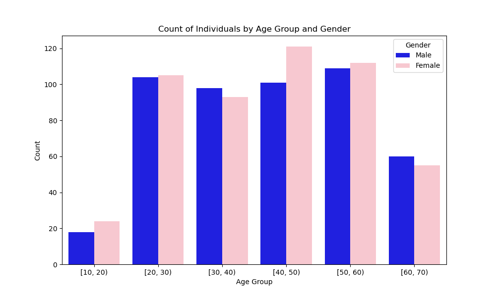
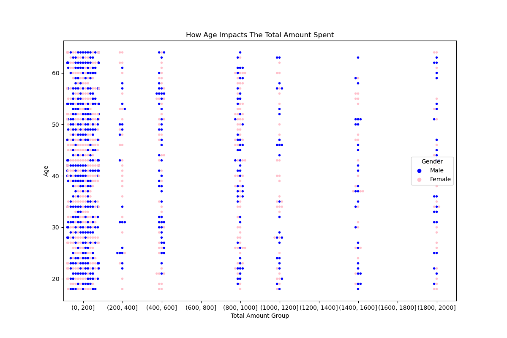

# Post Grad Independent Project - Sales Data Analyzing & Predicting

### Problem

In today's dynamic e-commerce landscape, businesses face the challenge of optimizing sales strategies and enhancing customer experiences amidst evolving consumer preferences and competitive pressures. The task of predicting sales by gender based on demographic and transactional data presents a crucial opportunity for targeted marketing and personalized engagement. However, achieving accurate sales by gender prediction is complex, requiring sophisticated data analysis techniques and predictive modeling.

As a Junior Data Analyst, I address the need for actionable insights derived from sales and customer data to drive business growth and enhance strategic decision-making. The primary objective is to develop a predictive model capable of accurately predicting gender based on demographic factors and transactional behavior. By leveraging statistical techniques, exploratory data analysis, and machine learning algorithms, the project aims to identify key patterns and trends that influence purchasing behavior across different demographic segments.

Through the development of a user-friendly Streamlit app, stakeholders gain access to intuitive tools for exploring data insights and making informed decisions. The project's findings offer valuable strategic implications for marketing and sales teams, empowering them to tailor strategies and promotions to specific gender demographics effectively.

### Data Dictionary

Definitions for each value set in the data: HERE (https://www.kaggle.com/datasets/mohammadtalib786/retail-sales-dataset)                                

### Executive Summary

In the fast-paced realm of e-commerce, leveraging data-driven insights is paramount for businesses striving to optimize sales strategies and enhance customer experiences. As a Junior Data Analyst, I undertake a comprehensive analysis and prediction endeavor centered on sales data.

The journey begins with meticulous data processing, where sales and customer data are cleaned and organized to ensure accuracy and consistency. Employing a combination of statistical techniques and visualization tools during Exploratory Data Analysis (EDA) uncovers intricate patterns and trends, providing a deeper understanding of customer behavior.

Modeling techniques are then employed to develop predictive models, iteratively refined to achieve optimal performance. The culmination of these efforts results in the creation of a user-friendly Streamlit app, offering stakeholders intuitive access to interactive visualizations and data insights.

Findings from the analysis are effectively utilized to inform strategic decision-making, identifying key factors influencing sales performance and customer behavior. Specifically, the project delves into age and gender dynamics, revealing nuanced insights into purchasing patterns across demographic segments.

The primary purpose of the project is to drive business growth through actionable insights, with a focus on optimizing sales strategies and enhancing customer experiences. Through the development of predictive models, internal teams gain the capability to forecast future sales based on demographic factors, such as gender.

The ideal outcomes of the project include increased revenue and market share, enhanced customer satisfaction and loyalty, empowerment of stakeholders with data-driven decision-making capabilities, and streamlined operations for improved efficiency and profitability.

Overall, this project underscores the importance of harnessing the power of data in navigating the complexities of the e-commerce landscape. By integrating data-driven insights into strategic planning processes, businesses can achieve sustainable growth and maintain a competitive edge in today's dynamic marketplace.

### Steps Taken: Cleaning, EDA, & Modeling

The project began with thorough data cleaning and organization to ensure the quality and consistency of the sales and customer data. This foundational step was crucial for subsequent analysis. 

During the Exploratory Data Analysis (EDA) phase, a variety of statistical techniques were employed to uncover patterns and trends within the dataset. 

Visualization tools were also utilized to enhance data exploration and facilitate a deeper understanding of the underlying insights. 

Following EDA, predictive models were developed and evaluated iteratively to gain insights into sales performance and customer behavior. These models underwent refinement to optimize their performance and ensure their effectiveness in informing strategic decision-making. 

Overall, the project's success hinged on the seamless integration of cleaning, EDA, and modeling techniques to derive actionable insights from the data.

### Key Visualizations

#### Visualization 1:[Count Of Individuals By Age Group]

The analysis explored the count of individuals within different age groups, shedding light on demographic trends that influence purchasing behavior. It was observed that purchasing patterns exhibited a distinct shift with age, with varying proportions of buyers across different age brackets. Notably, males tended to dominate in the 20-30 age group, while females led in the 40-50 age bracket. This insight suggested targeted marketing opportunities tailored to specific age demographics. Furthermore, the consistency of females representing slightly higher counts in retail purchases across all age groups underscored the significance of recognizing age-specific trends in gender-based buying behavior. Leveraging these insights enabled the development of more accurate predictive models and informed strategic decision-making aimed at optimizing sales strategies and enhancing customer experiences in the dynamic e-commerce environment.

#### Visualization 2: [How Age Impacts Total Amount Spent]

This visualization highlights the analysis delving into the impact of age on the total amount spent by customers, revealing intriguing insights into purchasing behavior across different age demographics. Across all age groups, the majority of purchases were observed within the 0 to 200 total amount spent range, with notable concentration. Notably, age-specific peaks in higher spending ranges, particularly between ages 25-30 and 45-55, suggested distinct purchasing behaviors linked to certain age demographics. This analysis illuminated age-related spending patterns, offering valuable insights into how different age groups allocate their expenditures. Understanding these nuances provided a foundation for refining sales strategies and tailoring marketing efforts to specific age demographics, thereby enhancing customer engagement and driving revenue growth.

### Conclusions

The project successfully transformed and analyzed sales and customer data to extract valuable insights that inform strategic decision-making in the e-commerce domain. Through rigorous data cleaning, exploratory data analysis, and predictive modeling, key patterns and trends were uncovered, providing actionable intelligence for marketing and sales teams. 

Notably, the analysis revealed age-specific variations in purchasing behavior and gender-based buying preferences, highlighting opportunities for targeted marketing strategies. 

By employing machine learning algorithms such as K-Nearest Neighbors, Logistic Regression, and Random Forest Classifier, the project identified the most effective model for gender prediction, showcasing the importance of model selection and parameter tuning. 

These insights underscore the significance of data-driven decision-making in driving business outcomes and gaining a competitive edge in the ever-evolving e-commerce landscape. 

### Recommendations:

Focus On:

- Utilizing age-specific marketing strategies to capitalize on variations in purchasing behavior across different age demographics.
- Implementing targeted promotional campaigns tailored to gender-based buying preferences, leveraging insights derived from predictive modeling.

Prioritize:

- Continuous data refinement efforts to enhance the accuracy and relevance of predictive models over time.
- Cross-functional collaboration between data analysts, marketing specialists, and sales teams to ensure alignment of strategies with customer dynamics and preferences.

